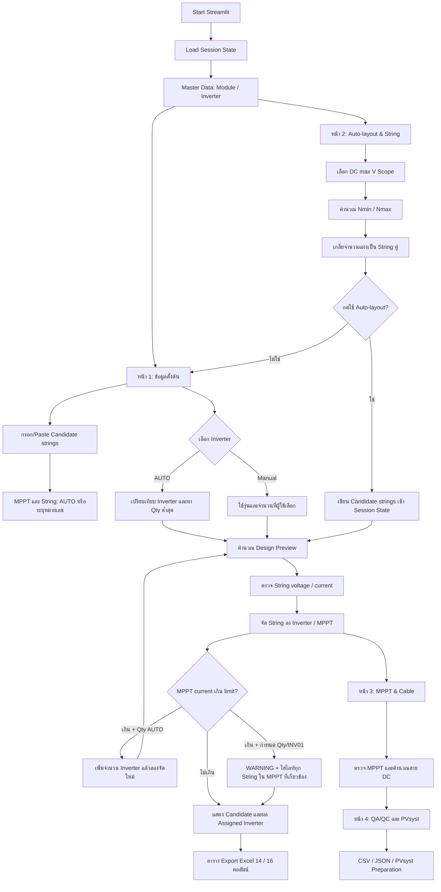

# Solar Rooftop String & MPPT Design Assistant

เอกสารนี้อธิบาย Flow การทำงานของ Streamlit Application, การส่งข้อมูลระหว่างหน้า UI กับ Calculation Engine และสูตรหลักที่ใช้ในแต่ละขั้นตอน เพื่อให้เปิดอ่านบน GitHub ได้โดยไม่ต้องอ่าน source code ทั้งหมด

ไฟล์หลัก:

- [streamlit_app.py](./streamlit_app.py) — UI, Session State, ตาราง, สี Highlight และ Export
- [calculation_engine.py](./calculation_engine.py) — สูตรไฟฟ้า, String, MPPT, สาย DC, QA/QC และ PVsyst preparation
- [PROGRAM_GUIDE.md](./PROGRAM_GUIDE.md) — คู่มือการใช้งานและรายละเอียด Config

> **Engineering notice:** โปรแกรมเป็นเครื่องมือช่วยออกแบบเบื้องต้น ผลลัพธ์ต้องยืนยันกับ datasheet ล่าสุด, PAN/OND, มาตรฐาน, สภาพหน้างาน, PVsyst และวิศวกรผู้มีใบอนุญาตก่อนนำไปใช้งานจริง

## 1. ภาพรวมการทำงาน



### ลักษณะการทำงานของ Streamlit

1. Streamlit จะ rerun script เมื่อผู้ใช้เปลี่ยน widget, กดปุ่ม หรือ Submit form
2. ทุก `st.tabs()` ถูกสร้างในรอบเดียวกัน ส่วน `with tabX:` ใช้กำหนดตำแหน่งแสดงผล ไม่ได้แยก process ออกจากกัน
3. ข้อมูลที่ต้องคงอยู่ระหว่าง rerun เก็บใน `st.session_state` ได้แก่:
   - `module_master` — Master Data ของแผง
   - `inverter_master` — Master Data ของ Inverter
   - `roof_groups` — Candidate strings / Roof layout
   - `roof_editor_revision` — version ของตารางเพื่อบังคับ refresh ค่า calculated columns
4. Calculation Engine ไม่ import Streamlit จึงสามารถทดสอบแยกด้วย unit tests ได้

## 2. ลำดับการทำงานตามหน้าโปรแกรม

### หน้า 1 — ข้อมูลตั้งต้น

ผู้ใช้กำหนด:

- รุ่นแผง, กำลังแผง และ suffix
- รุ่น Inverter หรือ `AUTO`
- จำนวน Inverter หรือ `AUTO`
- Tmin, Tcell,max และ voltage safety factor
- DC/AC ratio สูงสุด
- วัสดุและขนาดสาย DC
- Roof layout / Candidate strings รวม `inverter_override`, `mppt_override` และ `input_override`

เมื่อเลือกรุ่น Inverter หรือจำนวน Inverter เป็น `AUTO` โปรแกรมจะทำงานดังนี้:

1. รวมกำลัง DC จาก Candidate strings
2. คำนวณจำนวน Inverter ขั้นต่ำจาก DC/AC ratio
3. ทดลองจัด String ลง MPPT ของแต่ละรุ่น
4. ตรวจทั้งจำนวน input และกระแสรวมของแต่ละ MPPT
5. ถ้า MPPT current เกิน limit และจำนวนเป็น `AUTO` ให้ลองจำนวน Inverter ถัดไปจนกว่าจะจัดได้โดยทุก assignment เป็น `PASS`
6. รับเฉพาะแผนที่ String ผ่านแรงดัน/กระแส, MPPT assignment เป็น `PASS` และ DC/AC ratio ผ่าน
7. เลือกแผนที่มีจำนวนเครื่องน้อยที่สุด โดยเรียงรองด้วย DC/AC ratio และ Inverter ID

กรณีที่ผู้ใช้กำหนดจำนวน Inverter หรือกำหนด String เป็น `INV01` ทั้งหมด ระบบจะคง physical assignment ที่หาได้ไว้แม้กระแสรวม MPPT เกิน limit และเปลี่ยนสถานะเป็น `WARNING` เพื่อให้ตรวจสอบได้ตรงจุด

ผลลัพธ์หน้า 1 ประกอบด้วย:

- Summary modules, DC kWp, Inverter sets และ Project DC/AC ratio
- ตารางกรอกข้อมูล Roof layout
- ผลการจัด Inverter ราย String พร้อมสถานะ MPPT current
- แถบ `WARNING` สีแดงเมื่อกระแส MPPT เกิน limit
- ไฮไลท์สีแดงทั้งแถวของทุก String ที่อยู่ใน Inverter/MPPT กลุ่มเดียวกับ MPPT ที่มีปัญหา
- ตาราง Export Excel แบบ String/MPPT 14 คอลัมน์
- ตาราง Export Excel แบบรวม Input + Assignment 16 คอลัมน์

### หน้า 2 — Auto-layout & String

1. รับจำนวนแผงรวม
2. ตรวจว่าจำนวนรวมเป็นเลขคู่ เนื่องจาก Rapid Shutdown / Optimizer อัตรา 2:1; ถ้าเป็นเลขคี่จะแสดง WARNING และลงเศษใน 1 String
3. เลือก `AUTO (อ้างอิง Inverter จากหน้า 1)` หรือเลือก DC max V ที่มีจริงใน Master Inverter
4. คำนวณช่วงจำนวนแผงต่อ String
5. เกลี่ย String ให้จำนวนแผงเป็นเลขคู่ และแต่ละ String ต่างกันไม่เกิน 2 แผง
   หากยอดรวมเป็นเลขคี่ จะมี String เลขคี่เป็นเศษ 1 String และแสดง `WARNING`
6. ผู้ใช้กด **ใช้ Auto-layout แทน Candidate strings** เพื่อส่งผลกลับไปหน้า 1

> หากจำนวนรวมเป็นเลขคี่ ระบบยังคำนวณได้โดยนำเศษลง 1 String เท่านั้น; String นั้นจะเป็น `WARNING` และยังต้องต่างกันไม่เกิน 2 แผง

เมื่อเลือก DC max V แบบกำหนดเอง โปรแกรมจะ override เฉพาะ `dc_max_v` ส่วน MPPT min/max และ startup จะยังอ้างอิง Inverter ที่เลือกจากหน้า 1

### หน้า 3 — MPPT & Cable

- แสดงสรุปการแบ่งชุด Inverter
- แสดง MPPT และ String ภายในแต่ละ Inverter
- String ที่ต่อขนานใน MPPT เดียวกันต้องมีจำนวนแผง, orientation และ shading เหมือนกัน
- ตรวจจำนวน input, กระแส MPPT และกระแสลัดวงจร
- คำนวณ Voltage drop และ Power loss ของสาย DC

### หน้า 4 — QA/QC & PVsyst

- ตรวจ suffix และสถานะ Verified ของ datasheet
- ตรวจ String เป็นเลขคู่และเกลี่ยต่างกันไม่เกิน 2 แผง
- ตรวจ String voltage/current และ MPPT assignment
- ตรวจสาย DC
- เตรียม PVsyst CSV และ Design Package JSON

## 3. สูตรที่ใช้ใน Calculation Engine

### 3.1 กำลังของ String และระบบ

```text
String DC (kWp) = จำนวนแผงใน String × Pmax ของแผง (W) ÷ 1,000

Total DC (kWp) = Σ String DC (kWp)

Total AC (kW) = Rated AC ของ Inverter × จำนวน Inverter

Project DC/AC ratio = Total DC (kWp) ÷ Total AC (kW)
```

### 3.2 แรงดันแผงที่อุณหภูมิต่ำและสูง

Temperature coefficient ใน Master Data เก็บเป็น `%/°C` จึงต้องหาร 100 ก่อนใช้ในสูตร

```text
βVoc = abs(βVoc จาก datasheet) ÷ 100
βVmp = βVmp จาก datasheet ÷ 100

Voc_cold = Voc_STC × [1 + βVoc × (25 − Tmin)]

Vmp_hot = Vmp_STC × [1 + βVmp × (Tcell,max − 25)]
```

### 3.3 ขีดจำกัดจำนวนแผงต่อ String

```text
Nmax_absolute = FLOOR(Inverter DC max V ÷ Voc_cold)

Nmax_design = FLOOR(Inverter DC max V × Voltage safety factor ÷ Voc_cold)

Nmin_MPPT = CEILING(Inverter MPPT min V ÷ Vmp_hot)
```

ความหมาย:

- `Nmax_absolute` — ขีดจำกัดทางกายภาพจาก DC max V
- `Nmax_design` — ขีดจำกัดที่มี safety margin สำหรับการออกแบบ
- `Nmin_MPPT` — จำนวนแผงขั้นต่ำเพื่อให้แรงดันทำงานถึงช่วง MPPT

### 3.4 เกณฑ์ Auto-layout String

Auto-layout จะค้นหาจำนวน String ตั้งต้นจาก:

```text
Initial string count = MAX(1, CEILING(Total modules ÷ Nmax_design))
```

จากนั้นเพิ่มจำนวน String ทีละ 1 จนพบการแบ่งที่ผ่านเงื่อนไข:

```text
ทุก String เป็นเลขคู่เมื่อยอดรวมเป็นเลขคู่; ถ้ายอดรวมเป็นเลขคี่ให้มีเลขคี่ได้เพียง 1 String
Nmin_MPPT ≤ จำนวนแผงต่อ String ≤ Nmax_design
MAX(จำนวนแผงต่อ String) − MIN(จำนวนแผงต่อ String) ≤ 2
ผลรวมจำนวนแผงทุก String = Total modules
```

การเกลี่ยใช้ขนาดต่ำ `low` และขนาดสูง `high`:

```text
high = low + 2
จำนวนแผงที่เหลือ = Total modules − (low × จำนวน String)
จำนวน String ขนาด high = จำนวนแผงที่เหลือ ÷ 2
```

กรณียอดรวมเป็นเลขคี่ ระบบจะสำรอง 1 String เป็นเศษเลขคี่:

```text
จำนวน String ที่เหลือ = จำนวน String ทั้งหมด − 1
จำนวนแผงที่เหลือ = Total modules − odd_size
จำนวน String ขนาด high
    = (จำนวนแผงที่เหลือ − (low × จำนวน String ที่เหลือ)) ÷ 2
```

ถ้าจำนวนแผงรวมเป็นเลขคี่ ระบบยังสร้างคำแนะนำได้โดยนำเศษเหลือลง 1 String และคงสถานะ `WARNING`; ถ้าแบ่งให้ต่างกันไม่เกิน 2 แผงไม่ได้ หรือมีเลขคี่เกิน 1 String จะไม่สร้างคำแนะนำ

### 3.5 เงื่อนไขผ่านของแต่ละ String

สำหรับ String ที่มี `n` แผง:

```text
String Voc cold = n × Voc_cold
String Vmp hot  = n × Vmp_hot
String Vmp STC  = n × Vmp_STC
```

String จะเป็น `PASS` เมื่อผ่านทุกข้อ:

```text
ถ้ายอดรวมเป็นเลขคู่: `n` เป็นเลขคู่; ถ้ายอดรวมเป็นเลขคี่: มี `n` เป็นเลขคี่ได้ 1 String เท่านั้น
จำนวนแผงในกลุ่มต่างกันไม่เกิน 2 แผง
n ≥ Nmin_MPPT
n ≤ Nmax_design
String Vmp hot ≥ Startup voltage
String Vmp hot ≥ MPPT min voltage
String Vmp hot ≤ MPPT max voltage
String Voc cold ≤ Inverter DC max V
Module Imp ≤ Maximum current per DC input
```

### 3.6 การจัด String ลง MPPT

แต่ละ physical Inverter จะสร้าง Slot ตามสูตร:

```text
จำนวน Slot ต่อ Inverter = MPPT quantity × Inputs per MPPT
จำนวน Slot ทั้งโครงการ = จำนวน Slot ต่อ Inverter × Inverter quantity
```

String จะถูกจัดลง MPPT ได้เมื่อ:

```text
จำนวน String ใน MPPT เดียวกัน < Inputs per MPPT
```

และข้อมูลใน MPPT เดียวกันต้องเหมือนกัน:

```text
จำนวนแผงเท่ากัน
Orientation เท่ากัน
Shading เท่ากัน
```

ตรวจสอบกระแสของ MPPT:

```text
จำนวน String ใน MPPT × String Imp ≤ Maximum current per MPPT

จำนวน String ใน MPPT × String Isc ≤ Maximum short-circuit current per MPPT
```

ผลสรุปต่อ MPPT:

```text
MPPT total modules = จำนวนแผงต่อ String × จำนวน String ใน MPPT
```

การจัดจริงแยกเป็น 2 ระดับ:

- Engine จะพยายามเลือก physical input ที่ผ่านทั้งจำนวน input และกระแสก่อน
- หากมี physical input แต่กระแสรวมของ MPPT เกิน `max_i_mppt_a` หรือ `max_isc_mppt_a` ระบบยังเก็บ assignment ไว้เพื่อให้ตรวจสอบได้ และกำหนด `assignment_status`/`mppt_current_status` เป็น `WARNING`
- หน้า 1 จะขยายสถานะนี้ไปยังทุก String ที่อยู่ใน Inverter และ MPPT เดียวกัน แล้วไฮไลท์สีแดงทั้งแถวในตารางผลการจัดและตาราง Export ที่แสดงบนหน้าจอ

`unassigned_strings` ในตารางเปรียบเทียบ AUTO คือจำนวนช่อง Input ที่ยังว่าง:

```text
Total inputs = MPPT quantity × Inputs per MPPT × Inverter quantity

unassigned_strings = MAX(0, Total inputs − assigned_strings)
```

### 3.7 การเลือกจำนวน Inverter แบบ AUTO

จำนวนขั้นต่ำจาก DC/AC ratio สำหรับแต่ละรุ่น:

```text
Minimum DC quantity = CEILING(
    Total DC (kWp) ÷ (Rated AC (kW) × Maximum DC/AC ratio)
)
```

จากนั้นโปรแกรมจะทดลองจำนวนเครื่องตั้งแต่ค่าขั้นต่ำขึ้นไป จนพบแผนที่:

```text
String electrical status ทุกแถว = PASS หรือ WARNING เฉพาะกรณีมีเศษ 1 String
Assignment status ทุกแถว = PASS
Actual DC/AC ratio ≤ Maximum DC/AC ratio
```

ดังนั้น หาก 1 เครื่องจัดได้ครบทาง physical input แต่มี MPPT current warning
จะยังไม่ถือว่าเป็นแผน `PASS` สำหรับการเลือกแบบ `AUTO` และระบบจะลองเพิ่มจำนวน
Inverter ต่อไป ตัวอย่าง 14 String กับ SG125CX-P2 จะขยับเป็น 2 เครื่องเมื่อ 1 เครื่องมี
MPPT current เกิน limit ส่วนกรณีผู้ใช้ล็อกจำนวนไว้ 1 เครื่อง ระบบจะแสดง assignment
พร้อม `WARNING` และไฮไลท์ MPPT ที่เกี่ยวข้องแทนการซ่อนแถว

### 3.8 DC/AC ratio ราย Inverter

```text
DC/AC ratio ราย Inverter
    = Assigned DC (kWp) ÷ Rated AC (kW)
```

สถานะ:

- `PASS` — ratio อยู่ระหว่าง 0.80 และเกณฑ์สูงสุด
- `WARNING` — ratio ต่ำกว่า 0.80
- `FAIL` — ratio สูงกว่าเกณฑ์ที่กำหนด

### 3.9 สูตรสาย DC

ค่าคงที่ใน Engine:

```text
Copper resistivity ρ = 0.0175 Ω·mm²/m
Aluminium resistivity ρ = 0.0282 Ω·mm²/m
Temperature factor = 1.2
Connector allowance = 0.002 Ω
```

สูตร:

```text
Loop length = 2 × One-way cable length

Conductor resistance
    = ρ × Temperature factor × Loop length ÷ Cable area

Total resistance = Conductor resistance + Connector allowance

Voltage drop (V) = String Imp × Total resistance

Voltage drop (%) = Voltage drop (V) ÷ String Vmp STC × 100

Power loss (%)
    = String Imp² × Total resistance ÷ String DC power (W) × 100
```

สถานะสาย DC เป็น `PASS` เมื่อ:

```text
Voltage drop (%) ≤ Maximum voltage drop
Power loss (%) ≤ Maximum DC loss
```

ถ้าไม่กรอก One-way cable โปรแกรมยังคำนวณ String/MPPT ได้ แต่จะแสดงสถานะสายเป็น `WARNING`

### 3.10 Equivalent resistance สำหรับ PVsyst

PVsyst preparation จะรวมกลุ่มตาม:

```text
Inverter, จำนวนแผงต่อ String, Orientation, Tilt และ Azimuth
```

เมื่อมีข้อมูลสายครบทุก String ในกลุ่ม จะคำนวณความต้านทานเทียบเท่าแบบถ่วงน้ำหนักด้วยกระแส:

```text
Equivalent resistance
    = Σ(String Imp² × String resistance) ÷ Σ(String Imp²)
```

## 4. สถานะและการตรวจสอบ

| สถานะ | ความหมาย |
|---|---|
| `PASS` | ผ่านเกณฑ์ที่กำหนด |
| `WARNING` | ยังใช้งานต่อได้ แต่ต้องทบทวนหรือกรอกข้อมูลเพิ่ม |
| `FAIL` | ไม่ผ่านเกณฑ์ ต้องแก้ไขก่อนใช้ผลลัพธ์ |
| `UNASSIGNED` | ยังไม่มี MPPT/Input ที่รองรับ String |
| `REQUIRES VERIFICATION` | ข้อมูล datasheet หรือไฟล์ PAN/OND ยังไม่ยืนยัน |

QA/QC checks หลัก:

| Check | ตรวจสอบ |
|---|---|
| QA-01 | Module suffix ถูกกรอก |
| QA-02 | Module และ Inverter มีสถานะ Verified |
| QA-03 | String เป็นเลขคู่และต่างกันไม่เกิน 2 แผง; ยอดคี่อนุญาตเลขคี่ 1 String เป็น WARNING |
| QA-04 | String ผ่านช่วงแรงดัน/กระแส |
| QA-05 | String ถูกจัดลง MPPT ที่เข้ากันได้ |
| QA-06 | Voltage drop และ Power loss ของสาย DC |
| QA-07 | มีไฟล์ PAN และ OND ที่ยืนยันแล้ว |

## 5. ไฟล์ผลลัพธ์และการ Export

- `pvsyst_preparation.csv` — ตารางเตรียมข้อมูลสำหรับ PVsyst
- `solar_design_package.json` — inputs, limits, strings, inverter sets และ assignments
- `solar_string_mppt_export.xlsx` — ตารางผล String/MPPT 14 คอลัมน์
- `solar_string_input_assignment_export.xlsx` — ตารางรวมข้อมูลกรอก 1–11 และผลจัด 12–16

ตาราง Export ที่แสดงบนหน้า 1 ใช้สีแดงทั้งแถวเดียวกับตารางผลการจัด เมื่อ String อยู่ใน
Inverter/MPPT กลุ่มที่มี `WARNING`; คอลัมน์ MPPT และ String ในตารางจึงใช้ติดตามจุดที่ต้องแก้ไขได้ทันที

## 6. การรันและทดสอบบนเครื่อง Local

ติดตั้ง dependencies:

```bash
python -m pip install -r requirements.txt
```

เปิดโปรแกรม:

```bash
streamlit run streamlit_app.py
```

ตรวจ syntax:

```bash
python -m py_compile streamlit_app.py calculation_engine.py test_calculation_engine.py
```

รัน Calculation tests:

```bash
pytest -q
```

หรือรัน test functions โดยตรง:

```bash
python -c "import test_calculation_engine as t; tests=[n for n in dir(t) if n.startswith('test_')]; [getattr(t,n)() for n in tests]; print(f'{len(tests)} tests passed')"
```
